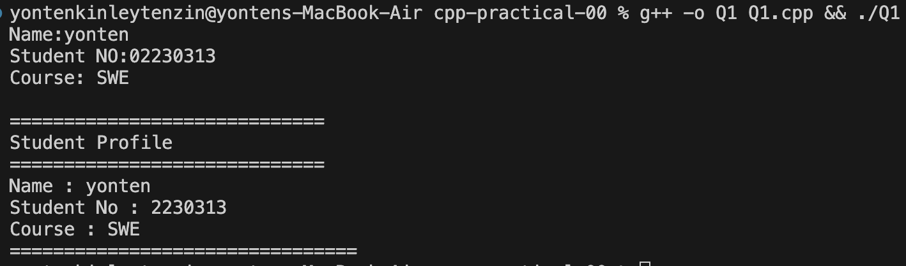
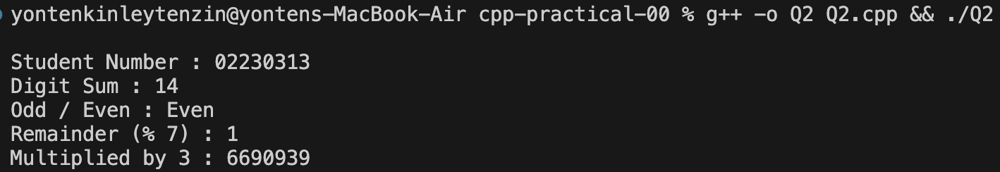
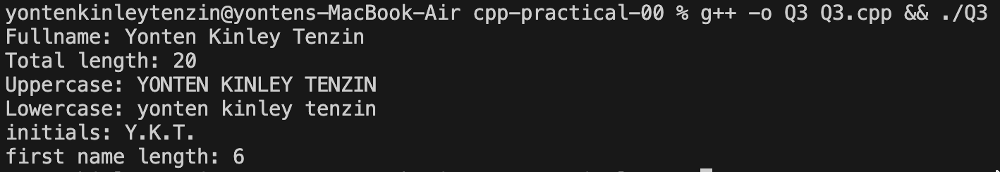
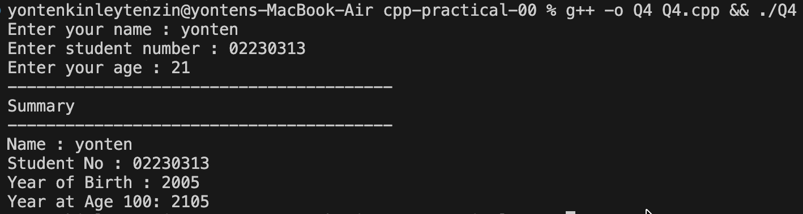
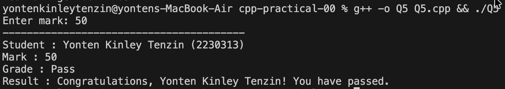
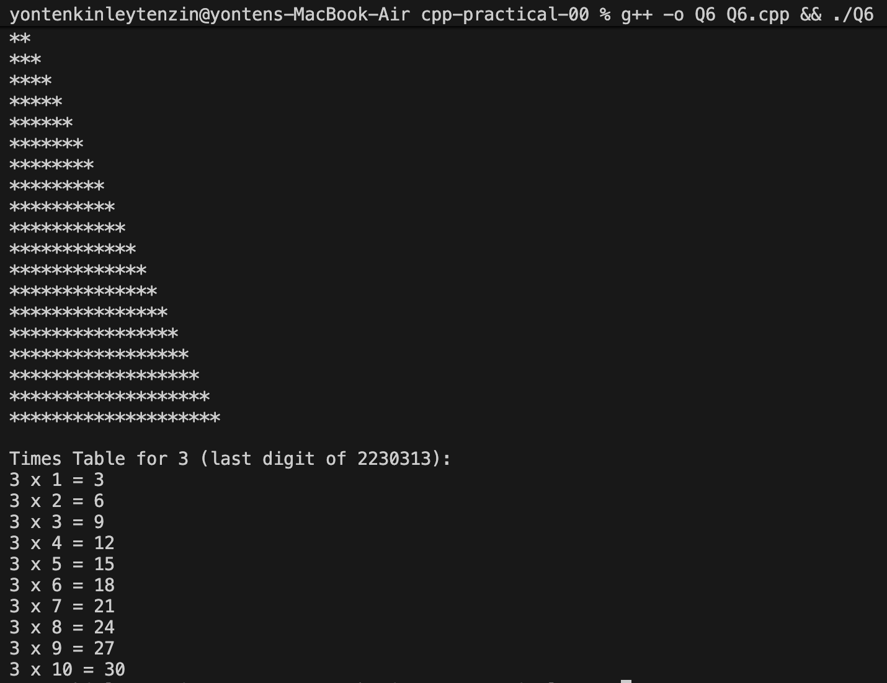
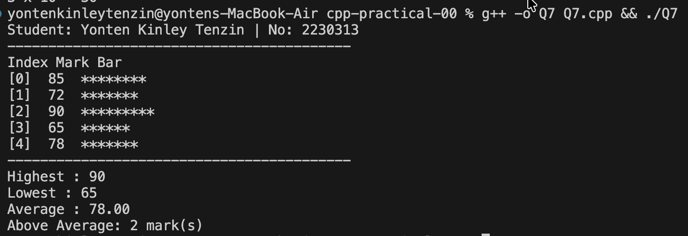
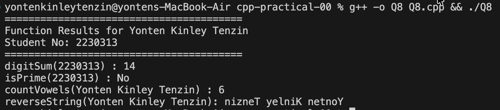
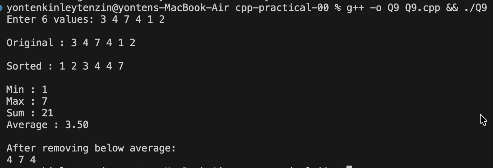
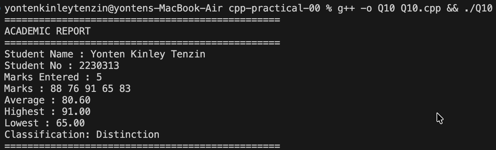

# C++ Practical Report- Practical 00

## Q1. Personal Introduction Output
#### Screenshot

- This program asks the user to enter their name, student number, and course, and then displays this information in a simple formatted profile. It shows how basic input and output operations work in C++ by taking information from the user and printing it on the screen.

## Q2. Arithmetic with Student Number

### Screenshot

- Here I performed a mathematical operations on my student number (2230313), calculating the sum of digits, checking if it is odd or even, finding the remainder when divided by 7, and multiplying it by 3.

## Q3. String Manipulation & Analysis
- This program manipulates my full name (Yonten Kinley Tenzin) by displaying its length, converting it to uppercase and lowercase, extracting initials, and finding the first name length.

### Screenshot

## Q4. User Input & Type Conversion
- Here the program takes the user's information (name, student number, and age), then calculates and displays the birth year and the year when the person will turn 100 years old.

### Screenshot

## Q5. Conditional Grade Classification
- Here the program classifies a student mark into grades: Distinction (75+), Merit (60-74), Pass (40-59), or Fail (below 40). It validates the mark is between 0-100 and displays a personalized result message.

### Screenshot

## Q6. Loop-Based Pattern Generation

### Screenshot

- This program uses loops to: (1) print my first name multiple times based on its length, (2) create an asterisk triangle pattern, and (3) generate a multiplication table for the last digit of my student number.

## Q7. Array Operations & Statistics
- This program stores 5 marks in an array and displays them with bar chart visualization. It calculates and shows the highest mark, lowest mark, average, and counts how many marks are above the average.

### Screenshot

## Q8. Function Design & Modular Programming
- This program implements four custom functions: digitSum() to add all digits in a number, isPrime() to check if a number is prime, countVowels() to count vowels in a string, and reverseString() to reverse text.

### Screenshot

## Q9. Vector & Dynamic Collections
- This program uses vectors to store 6 user-input values, then displays the original and sorted versions. It calculates and shows the minimum, maximum, sum, and average of all values.

### Screenshot

## Q10. Classes & Object-Oriented Design
Here the program creates a Student class that stores student information and marks. It includes methods to add marks, calculate average, find highest and lowest marks, and determine grade classification.

### Screenshot

## Conclusion

This practical helped me learn and apply many basic C++ programming concepts. I used cin and cout for input and output, worked with different data types like integers, strings, and floats, and performed arithmetic operations such as calculations and digit manipulation. I also practiced string operations, including finding length and changing case. I used if-else statements for decision making and loops like for and while loops to repeat tasks and create patterns. I learned to use arrays and vectors to store multiple values and created functions to make reusable code. Finally, I applied object-oriented programming by creating classes with methods and encapsulation. Each program helped me move from simple concepts to more advanced C++ programming.

---
